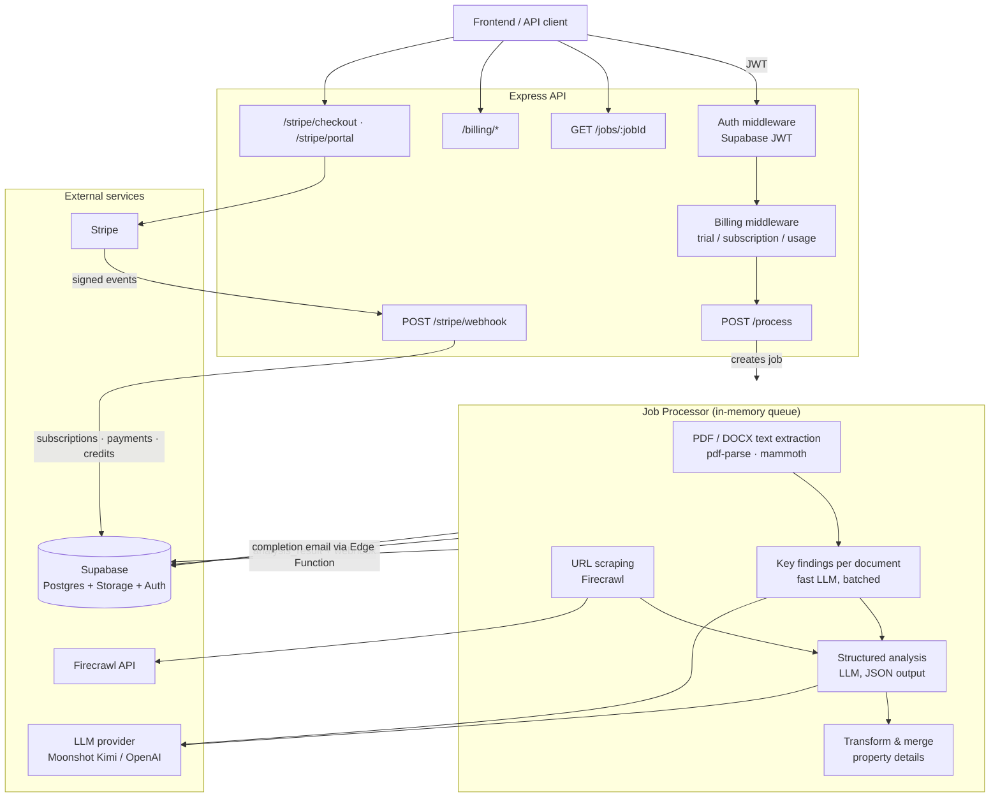

# Legal Pack Processor

Backend service that analyzes property auction legal packs. It extracts text from PDF/DOCX documents, optionally scrapes the property listing URL, runs LLM analysis (Moonshot Kimi or OpenAI), and writes a structured risk report back to Supabase. Includes Stripe billing with trials, subscriptions, and usage limits.

## Architecture



### Processing flow

1. Client calls `POST /process` with a Supabase JWT. Auth middleware verifies the token; billing middleware checks trial credits, subscription usage, or per-report payment.
2. A job is created in an in-memory queue and processed asynchronously (HTTP returns `202` immediately).
3. The worker downloads the report's files from Supabase Storage, extracts text (`pdf-parse` for PDF, `mammoth` for DOCX), and optionally scrapes the listing URL with Firecrawl.
4. Key findings are generated per document (batched, concurrent), then a single structured analysis pass produces the full JSON report.
5. The result is written to the `reports` table, an optional webhook is called, and a completion email is sent via a Supabase Edge Function.

## Prerequisites

- Node.js >= 20
- Supabase project (Postgres, Auth, Storage bucket `legal-packs`)
- Moonshot or OpenAI API key
- Optional: Firecrawl API key, Stripe account

## Setup

```bash
npm install
cp .env.example .env   # fill in your values
npm run dev            # development
# or
npm run build && npm start
```

> **Migrations:** the canonical, complete migration set (billing tables, RPC functions, RLS policies) lives in the [asta-legal-insight](https://github.com/astahq/asta-legal-insight) repo under `supabase/migrations/`. The copies in this repo's `supabase/migrations/` are a stale subset kept for reference — apply the dashboard repo's migrations to your Supabase project.

## Environment Variables

### Required

| Variable | Description |
|---|---|
| `SUPABASE_URL` | Supabase project URL |
| `SUPABASE_SERVICE_ROLE_KEY` | Service role key (server-side only) |
| `OPENAI_API_KEY` | OpenAI API key |
| `MOONSHOT_API_KEY` | Required when `LLM_PROVIDER=kimi` (default) |

### Optional

| Variable | Default | Description |
|---|---|---|
| `PORT` | `3000` | Server port |
| `NODE_ENV` | `development` | Environment |
| `CORS_ORIGIN` | `*` | Allowed origins, comma-separated |
| `LLM_PROVIDER` | `kimi` | `kimi` or `openai` |
| `LLM_BATCH_SIZE` | `5` | Documents per key-findings batch |
| `LLM_CONCURRENCY` | `2` | Concurrent LLM batch requests |
| `LLM_USE_FAST_MODEL` | `true` | Use fast model for key findings |
| `FIRECRAWL_API_KEY` | — | Enables listing URL scraping |
| `SUPABASE_WEBHOOK_URL` | — | Completion webhook target |
| `WEBHOOK_SECRET` | — | Included in webhook payloads |
| `REPORT_BASE_URL` | — | Base URL used in report links / emails |
| `FRONTEND_URL` | — | Redirect target for Stripe checkout/portal |
| `STRIPE_SECRET_KEY` | — | Stripe secret key (billing disabled if unset) |
| `STRIPE_WEBHOOK_SECRET` | — | Stripe webhook signing secret |
| `STRIPE_PRICE_SINGLE_REPORT` | — | Price ID for one-off report payment |
| `STRIPE_PRICE_PRO_MONTHLY` | — | Price ID for legacy pro subscription |
| `STRIPE_PRICE_STARTER_MONTHLY` | — | Price ID for starter plan |
| `STRIPE_PRICE_PROFESSIONAL_MONTHLY` | — | Price ID for professional plan |

## API

All authenticated endpoints expect `Authorization: Bearer <supabase-jwt>`.

| Method | Path | Auth | Description |
|---|---|---|---|
| `GET` | `/health` | — | Health check |
| `POST` | `/process` | JWT + billing | Queue a legal pack analysis job |
| `GET` | `/jobs/:jobId` | JWT | Job status (owner only) |
| `GET` | `/billing/status` | JWT | Access, trial, subscription, and usage info |
| `GET` | `/billing/plans` | — | Active plans |
| `POST` | `/billing/initialize-trial` | JWT | Start the free trial |
| `POST` | `/stripe/checkout` | JWT | Create a Stripe Checkout session (rate limited) |
| `POST` | `/stripe/portal` | JWT | Create a Stripe billing portal session (rate limited) |
| `POST` | `/stripe/webhook` | Stripe signature | Stripe event handler (idempotent) |

### POST /process

```json
{
  "reportId": "123e4567-e89b-12d3-a456-426614174000",
  "url": "https://example.com/property-listing"
}
```

`userId` is taken from the JWT (if sent in the body, it must match). `url` is optional. Responds `202` with `{ "jobId", "status", "message" }`; poll `GET /jobs/:jobId` for progress. On completion the `reports` row is updated with `analysis_result` (title, ownership, charges, covenants, tenure, planning, risks, per-document key findings, and merged property details).

A Postman collection is included: `Legal Pack Processor.postman_collection.json`.

## Development

```bash
npm run type-check
npm test
```

## Deployment

Configured for [Render](https://render.com) via `render.yaml` (build: `npm ci && npm run build`, start: `npm start`). Set the environment variables above in your Render dashboard. Point your Stripe webhook endpoint at `https://<your-service>/stripe/webhook`.

## License

[MIT](LICENSE)
